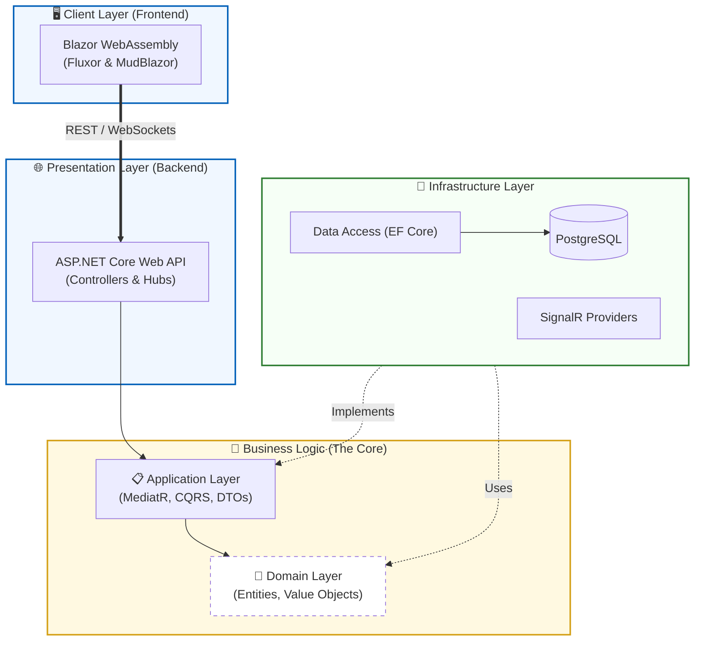
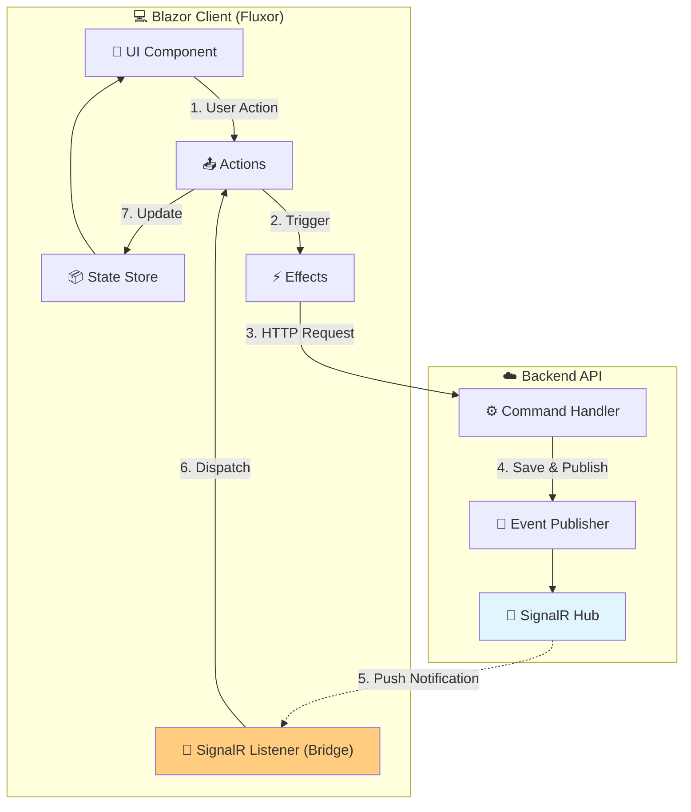

# FocusFlow - Task Management System

A production-ready task management application built with .NET 8, demonstrating **Onion Architecture**, **CQRS**, **Fluxor state management**, comprehensive testing, and containerized deployment.

---

## 📋 Table of Contents

- [Prerequisites](#-prerequisites)
- [Quick Start](#-quick-start)
  - [Docker Compose (Recommended)](#docker-compose-recommended)
- [Architecture](#-architecture)
- [Testing](#-testing)
- [Technology Stack](#-technology-stack)
- [Key Design Decisions (ADR)](#-key-design-decisions-adr)
- [Project Structure](#-project-structure)

--- 

## 🎯 Prerequisites

| Tool | Version | Purpose |
|------|---------|---------|
| [.NET SDK](https://dotnet.microsoft.com/download/dotnet/8.0) | 8.0+ | Build & run application |
| [Docker Desktop](https://www.docker.com/products/docker-desktop) | Latest | Containerized deployment |
| [PostgreSQL](https://www.postgresql.org/download/) | 17+ | Database (if running locally) |
| [Git](https://git-scm.com/) | Latest | Version control |
| **Optional** | | |
| [Visual Studio 2022](https://visualstudio.microsoft.com/) | 17.8+ | IDE (recommended for Windows) |
| [Rider](https://www.jetbrains.com/rider/) | 2024.1+ | IDE (cross-platform) |
| [VS Code](https://code.visualstudio.com/) | Latest | Lightweight editor |

---

## 🚀 Quick Start

### Option 1: Docker Compose (Recommended)

**This is the fastest way to run the entire stack** (API + Blazor UI + PostgreSQL):

```bash
# 1. Clone the repository
git clone https://github.com/anastasiosm/FocusFlow.git
cd FocusFlow

# 2. Set up environment file
# Option A: Use the setup script (recommended - provides helpful info)
pwsh scripts/setup-env.ps1
# This script:
# - Copies .env.example to .env (with overwrite protection)
# - Shows current configuration (database, URLs)
# - Provides next steps and pro tips
# - Explains security considerations

# Option B: Manual setup (quick & silent)
cp .env.example .env
# Then edit .env if you need custom values

# 3. Build and start all services
# Option A: First time / debugging (shows logs in terminal)
docker-compose up --build

# Option B: Background mode (recommended for daily use)
docker-compose up -d --build

# Option C: View logs after starting in background
docker-compose logs -f

# 4. Access the application
# - Blazor UI:  http://localhost:5050
# - API:        http://localhost:8080
# - Swagger:    http://localhost:8080/swagger
# - Scalar API: http://localhost:8080/scalar/v1
# - Seq Logs:   http://localhost:8082
# - OpenAPI JSON document: http://localhost:8080/openapi/v1.json
(The API exposes an OpenAPI JSON document useful for tooling and client generation)

### 🏥 Health Check Endpoints

Both the API and Blazor applications expose health check endpoints for Kubernetes liveness and readiness probes.

**API Service (Port 8080):**
- **General Health:** `http://localhost:8080/health`
- **Readiness (Checks DB):** `http://localhost:8080/health/ready`
- **Liveness (Self check):** `http://localhost:8080/health/live`

**Blazor UI (Port 5050):**
- **General Health:** `http://localhost:5050/health`
- **Readiness (Checks API):** `http://localhost:5050/health/ready`
- **Liveness (Self check):** `http://localhost:5050/health/live`

For detailed information on the health check implementation, see [Kubernetes Health Checks Documentation](docs/KUBERNETES_HEALTH_CHECKS.md).

# 5. Stop services
docker-compose down
```

**Default test credentials:**
- Email: `test@example.com`
- Password: `Password123!`

**Notes:**
- First build takes ~2-5 minutes (subsequent builds are faster)
- PostgreSQL data persists in a Docker volume
- Development mode runs **HTTP-only** (no HTTPS certificates needed)
- To reset the database: `docker-compose down -v`

**Optional: HTTPS Setup for Production-Like Testing**

If you need HTTPS in Docker (not required for development):

```powershell
# Windows PowerShell
pwsh scripts/setup-dev-certs.ps1

# This script:
# - Generates a development certificate using dotnet dev-certs
# - Exports PFX to both ./certs/ (for Docker) and %USERPROFILE%/.aspnet/https (for local dotnet)
# - Trusts the certificate on Windows (interactive prompt)
# - Password defaults to CERT_PASSWORD env var or "MyPfxPassword123!"

# Then enable HTTPS in docker-compose.yml by uncommenting the HTTPS configuration
```

---

## 🏗️ Architecture

FocusFlow follows **Onion Architecture** (aka Clean Architecture) with **Vertical Slice** organization within features.

### High-Level Architecture



### Layer Responsibilities

| Layer | Responsibility | Dependencies |
|-------|---------------|--------------|
| **Domain** | Business entities, rules, exceptions | None (pure .NET) |
| **Application** | Use cases (CQRS), validation, DTOs | → Domain |
| **Infrastructure** | Data access, Identity, EF Core | → Application, Domain |
| **Presentation** | Blazor UI, Web API controllers | → Application, Infrastructure |

### Blazor UI Architecture (Fluxor + SignalR)

FocusFlow uses a **unidirectional data flow** pattern (Redux-style) powered by **Fluxor**, enhanced with **SignalR** for real-time synchronization across multiple browser tabs.



**Real-time Flow:**
1. **Action**: User modifies a task; a Fluxor Action is dispatched.
2. **Persistence**: An Effect calls the Web API via REST.
3. **Notification**: After saving to DB, the server publishes an event via `IEventPublisher`.
4. **Broadcast**: The SignalR Hub pushes the update to all clients in the relevant project group.
5. **Bridge**: The `SignalRTasksListener` intercepts the message and dispatches a Fluxor Action.
6. **Sync**: Reducers update the Store, and the UI re-renders automatically across all open tabs.

For a deep dive into this implementation, see [SignalR + Fluxor Architecture Documentation](docs/SIGNALR_FLUXOR_ARCHITECTURE.md).

---

## 🧪 Testing

FocusFlow has **5 test layers** with ~300 tests covering unit, integration, component, and end-to-end scenarios.

### Test Execution

```bash
# Run ALL tests (except E2E tests, because requires Docker for E2E tests)
dotnet test FocusFlow.sln --filter "Category!=E2E"

# Run E2E tests with Testcontainers orchestration
# First, build the Docker images:
pwsh scripts/build-e2e-images.ps1

# Then run the tests:
dotnet test tests/FocusFlow.E2E.Tests --filter "Category=E2E"

# Or run a specific test:
dotnet test tests/FocusFlow.E2E.Tests --filter "UserCanLoginSuccessfully"

# The Testcontainers framework automatically:
# - Starts fresh PostgreSQL container
# - Starts API container (focusflow-api:test image)
# - Starts Blazor container (focusflow-client:test image)
# - Creates custom Docker network for inter-container communication
# - Waits for container health checks
# - Runs Playwright tests against real containers
# - Cleans up all containers after tests complete

# Run specific test projects
dotnet test tests/FocusFlow.Domain.Tests              # Unit tests (Domain entities)
dotnet test tests/FocusFlow.Application.Tests         # Unit tests (CQRS handlers)
dotnet test tests/FocusFlow.Infrastructure.Tests      # Integration tests (Repositories)
dotnet test tests/FocusFlow.Integration.Tests         # API integration tests
dotnet test tests/FocusFlow.BlazorApp.Tests           # Blazor component tests (bUnit)
dotnet test tests/FocusFlow.E2E.Tests                 # E2E tests (Playwright)
```

### Test Coverage Summary

| Test Project | Type | Tests | Coverage | Purpose |
|-------------|------|-------|----------|---------|
| **Domain.Tests** | Unit | 50+ | ~95% | Entity business rules & validation |
| **Application.Tests** | Unit | 100+ | ~90% | CQRS handlers, validators, mappings |
| **Infrastructure.Tests** | Integration | 50+ | ~85% | Repository patterns, EF Core queries |
| **Integration.Tests** | Integration | 80+ | N/A | Full API endpoint testing (in-memory DB) |
| **BlazorApp.Tests** | Component | 60+ | N/A | Blazor components (bUnit), Fluxor effects |
| **E2E.Tests** | End-to-End | 15+ | N/A | Full user flows (Playwright + Docker) |

**Key Testing Frameworks:**
- **xUnit** - Test runner
- **FluentAssertions** - Readable assertions
- **Moq** - Mocking dependencies
- **Bogus** - Fake data generation
- **bUnit** - Blazor component testing
- **Playwright** - Browser automation (E2E)
- **WebApplicationFactory** - Integration testing (API)

### E2E Test Requirements

E2E tests use **Playwright + Testcontainers** and require:
1. **Docker Desktop** running
2. **Playwright browsers** installed: `pwsh tests/FocusFlow.E2E.Tests/playwright.ps1 install`
3. **PowerShell** 7+ (for `run-e2e-tests.ps1` script)

**E2E Test Architecture:**
- **Testcontainers** orchestrates 3 Docker containers: PostgreSQL + API + Blazor
- **Custom Docker network** enables inter-container communication
- **Shared DataProtection keys** volume for API ↔ Blazor authentication
- **Fresh database** per test suite (no data pollution)
- **Playwright** automates browser interactions against real Blazor container

**E2E Test Scenarios:**
- ✅ User registration & login flow
- ✅ Create/edit/delete projects
- ✅ Create/assign/complete tasks
- ✅ Dashboard statistics validation
- ✅ Authorization (non-owner cannot delete projects)

---

## 🛠️ Technology Stack

### Core Framework
- **.NET 8** - Latest LTS framework with improved performance

### Backend Libraries

| Package | Version | Purpose |
|---------|---------|---------|
| **MediatR** | 12.4.1 | CQRS implementation (Command/Query separation) |
| **FluentValidation** | 11.0.0 | Declarative, testable validation rules |
| **AutoMapper** | 13.0.1 | Entity-to-DTO mapping (eliminates boilerplate) |
| **Entity Framework Core** | 8.0.0 | ORM with Code-First migrations |
| **Npgsql.EntityFrameworkCore.PostgreSQL** | 8.0.0 | PostgreSQL provider for EF Core |
| **EFCore.NamingConventions** | 8.0.0 | Snake_case naming for PostgreSQL (best practice) |
| **ASP.NET Core Identity** | 8.0.0 | User authentication & role management |
| **Microsoft.AspNetCore.Authentication.JwtBearer** | 8.0.0 | JWT token authentication for API |
| **Swashbuckle.AspNetCore** | 6.6.2 | OpenAPI/Swagger documentation generation |
| **Scalar.AspNetCore** | 2.11.6 | Modern interactive API documentation UI |
| Scalar.AspNetCore | 2.11.6 | Modern interactive API documentation UI |
| **Microsoft.AspNetCore.SignalR** | (see project) | Real-time bi-directional communication hub |
| **Serilog.AspNetCore** | (see project) | Structured logging integration for ASP.NET Core and centralized logging pipelines |
| **Serilog.Enrichers.Environment** | (see project) | Adds environment metadata to Serilog events (machine, environment) |
| **Serilog.Enrichers.Thread** | (see project) | Adds thread id/name information to Serilog events |
| **Serilog.Sinks.Seq** | (see project) | Sends structured logs to Seq for centralized aggregation and analysis |

### Frontend Libraries

| Package | Version | Purpose |
|---------|---------|---------|
| **MudBlazor** | 7.8.0 | Material Design component library (rich UI components) |
| **Fluxor** | 6.9.0 | Redux-like state management for Blazor (predictable state) |
| **Fluxor.Blazor.Web** | (see project) | Blazor-specific Fluxor bindings and middleware |
| **Microsoft.AspNetCore.SignalR.Client** | (see project) | SignalR client for real-time updates |
| **Blazored.LocalStorage** | 4.5.0 | Browser LocalStorage wrapper (JWT persistence) |
| **Refit** | (see project) | Type-safe, interface-based REST API client used by the Blazor UI |
| **Blazored.FluentValidation** | 2.2.0 | Client-side FluentValidation integration |
| **System.IdentityModel.Tokens.Jwt** | 8.15.0 | JWT token parsing (client-side role extraction) |
| **Serilog.Sinks.BrowserConsole** | (see project) | Sends Serilog events to the browser console (useful for client-side debugging in development) |
| **Microsoft.AspNetCore.Components.Authorization** | (see project) | Blazor authentication abstractions and AuthenticationStateProvider integration |
| **Microsoft.Extensions.Http** | (see project) | HttpClientFactory helpers and typed/named client support |

### Testing & Static Analysis / CI Tools

| Tool / Package | Purpose |
|----------------|---------|
| **xUnit** | Test framework (industry standard for .NET) |
| **FluentAssertions** | Readable, expressive assertions |
| **Moq** | Mocking framework for dependencies |
| **Bogus** | Realistic fake data generation (addresses, names, dates) |
| **bUnit** | Blazor component testing framework |
| **Microsoft.Playwright** | Browser automation for E2E tests (Chromium/Firefox/WebKit) |
| **Testcontainers** | Docker container orchestration for integration tests (real PostgreSQL, API, Blazor containers) |
| **Microsoft.AspNetCore.Mvc.Testing** | In-memory API integration testing |
| **SonarAnalyzer.CSharp** | Static code analysis rules (runs in IDE / during build) |
| **SonarScanner.MSBuild** | Scanner used in CI to publish results to SonarQube / SonarCloud and enforce quality gates |

### Why These Libraries?

**MediatR** - Decouples request handling from controllers; single responsibility per handler; makes testing trivial  
**FluentValidation** - More expressive than Data Annotations; supports complex rules (e.g., "EndDate must be after StartDate"); testable in isolation  
**AutoMapper** - Eliminates 100+ lines of manual mapping code; convention-based; profile-based configuration  
**Fluxor** - Redux DevTools support; time-travel debugging; single source of truth for UI state  
**MudBlazor** - 60+ pre-built components; accessibility support; responsive grid system  
**bUnit** - Renders Blazor components in-memory; queries like jQuery; tests without browser overhead  
**Playwright** - Cross-browser; auto-wait for elements; video/screenshot capture on failure  
**Testcontainers** - Real Docker containers for E2E tests; eliminates test environment inconsistencies; supports PostgreSQL + API + Blazor orchestration  
**Scalar.AspNetCore** - Modern Swagger alternative; better UX than SwaggerUI; supports OpenAPI 3.1

---

## 📂 Project Structure

```text
FocusFlow/
├── src/
│   ├── FocusFlow.Domain/                # 💎 Core Domain (Pure C#)
│   │   ├── Entities/                    # (Project, Task, User)
│   │   ├── Enums/
│   │   └── Exceptions/
│   │
│   ├── FocusFlow.Application/           # 📋 Use Cases (CQRS & Vertical Slices)
│   │   ├── Projects/                    # Feature folder (Commands, Queries, Validators)
│   │   ├── Tasks/                       # Feature folder
│   │   ├── Dashboard/
│   │   └── Common/                      # Behaviours, Interfaces, Mappings
│   │
│   ├── FocusFlow.Infrastructure/        # 🔧 External concerns
│   │   ├── Data/                        # DbContext, EF Configurations
│   │   ├── Repositories/                # Repository Implementations
│   │   └── Identity/                    # ASP.NET Identity setup
│   │
│   ├── FocusFlow.WebApi/                # 🌐 Entry Point & Composition Root
│   │   ├── Program.cs                   # DI Container Setup (The Composition Root)
│   │   ├── Controllers/                 # Thin controllers (REST Endpoints)
│   │   └── Middleware/                  # Global Exception Handling
│   │
│   └── FocusFlow.BlazorApp/             # 🎨 UI Client (Feature-Based Architecture)
│       ├── Components/                  # Global Shared Components (Layout, App)
│       ├── Features/                    # Vertical Slices (UI + Logic per feature)
│       │   ├── Projects/                # (List, Detail, Create, Edit)
│       │   ├── Tasks/
│       │   ├── Auth/
│       │   └── Dashboard/
│       └── Services/                    # HttpClients & Infrastructure Wrappers
│
├── tests/
│   ├── FocusFlow.Domain.Tests/          # Unit Tests
│   ├── FocusFlow.Application.Tests/     # Unit Tests (Handlers & Validators)
│   ├── FocusFlow.Infrastructure.Tests/  # Integration Tests (DB)
│   ├── FocusFlow.Integration.Tests/     # API Integration Tests (WebApplicationFactory)
│   ├── FocusFlow.BlazorApp.Tests/       # Component Tests (bUnit)
│   └── FocusFlow.E2E.Tests/             # End-to-End (Playwright + Testcontainers)
│
├── scripts/                             # Setup & DevOps scripts
└── docker-compose.yml
```

---

## 🎯 Key Design Decisions (ADR)

For a detailed explanation including code examples and diagrams, see [Architecture Decision Records](docs/ADR.md).

#### **ADR-001: Onion Architecture**
*   **Decision:** Use Onion Architecture with a pure .NET Domain layer.
*   **Rationale:** Ensures zero external dependencies in business logic and high testability (~95% coverage).
*   **Consequences:** Increases initial setup complexity and number of projects.

#### **ADR-002: CQRS with MediatR**
*   **Decision:** Separate Commands (writes) from Queries (reads).
*   **Rationale:** Enforces Single Responsibility Principle and simplifies handler testing.
*   **Consequences:** Significantly increases file count (one class per operation).

#### **ADR-003: Vertical Slice Architecture**
*   **Decision:** Organize code by feature (e.g., `Features/Projects`) instead of layer.
*   **Rationale:** High cohesion; related code sits together (commands, queries, validators).
*   **Consequences:** Requires strict discipline to avoid dependencies between features.

#### **ADR-004: FocusFlow-Branded Exceptions**
*   **Decision:** Prefix domain exceptions with `FocusFlow` (e.g., `FocusFlowNotFoundException`).
*   **Rationale:** Clear identification in logs and easy global mapping to HTTP status codes.
*   **Consequences:** Verbose naming convention.

#### **ADR-005: FluentValidation**
*   **Decision:** Use FluentValidation instead of Data Annotations.
*   **Rationale:** Keeps validation logic out of entities; allows complex/async rules.
*   **Consequences:** Adds an external dependency to the Application layer.

#### **ADR-006: AutoMapper**
*   **Decision:** Use AutoMapper for Entity-to-DTO conversion.
*   **Rationale:** Eliminates boilerplate mapping code; centralizes configuration.
*   **Consequences:** Can hide mapping errors until runtime; "magic" behavior.

#### **ADR-007: Fluxor (Redux for Blazor)**
*   **Decision:** Use Fluxor for state management.
*   **Rationale:** Provides predictable unidirectional data flow and Time-Travel debugging.
*   **Consequences:** Higher learning curve compared to simple cascading parameters.

#### **ADR-008: MudBlazor**
*   **Decision:** Use MudBlazor component library.
*   **Rationale:** Rapid UI development with rich, accessible Material Design components.
*   **Consequences:** Increases initial bundle size (mitigated by tree-shaking).

#### **ADR-009: Playwright for E2E**
*   **Decision:** Use Playwright for end-to-end testing.
*   **Rationale:** Modern API with auto-wait reduces flakiness; cross-browser support.
*   **Consequences:** Requires local browser installation.

#### **ADR-010: PostgreSQL**
*   **Decision:** Use PostgreSQL as the primary database.
*   **Rationale:** Robust open-source option with excellent Docker support and JSON capabilities.
*   **Consequences:** Syntax differences from SQL Server (e.g., `SERIAL` vs `IDENTITY`).

#### **ADR-011: JWT Authentication**
*   **Decision:** Use stateless JWT tokens.
*   **Rationale:** Scalable; works across different clients (Web, Mobile, CLI).
*   **Consequences:** Requires implementing explicit token refresh logic.

#### **ADR-012: Docker Compose for Development**
*   **Decision:** Use Docker Compose as the standard dev environment.
*   **Rationale:** Ensures environment consistency ("works on my machine") and fast onboarding.
*   **Consequences:** Higher RAM usage compared to running IIS Express.

#### **ADR-013: HTTP-Only Development**
*   **Decision:** Run containers on HTTP locally.
*   **Rationale:** Simplifies setup by avoiding certificate management for new developers.
*   **Consequences:** Slight parity gap with Production (which uses HTTPS).

#### **ADR-014: Repository Pattern**
*   **Decision:** Use Repositories alongside EF Core.
*   **Rationale:** Decouples business logic from data access details; simplifies mocking.
*   **Consequences:** Can add redundant abstraction over `DbSet`.

#### **ADR-015: bUnit for Component Tests**
*   **Decision:** Use bUnit for Blazor testing.
*   **Rationale:** Extremely fast execution (~100ms); tests logic without a browser.
*   **Consequences:** Cannot verify visual layout or CSS rendering.

#### **ADR-016: Testcontainers for E2E**
*   **Decision:** Use Testcontainers to orchestrate tests.
*   **Rationale:** Tests against real infrastructure (DB, API) ensuring true integration validity.
*   **Consequences:** Slower test startup and higher resource consumption (4GB+ RAM).

#### **ADR-017: SignalR for Real-Time**
*   **Decision:** Use SignalR for bi-directional communication.
*   **Rationale:** Enables instant updates (Push) across tabs/users; utilizes WebSocket abstraction.
*   **Consequences:** Adds complexity by introducing a second data flow path (Push vs Pull) that must be bridged to the State Store.

---