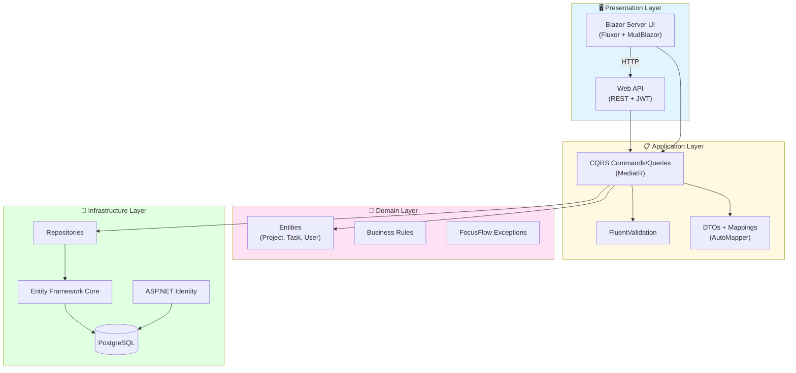
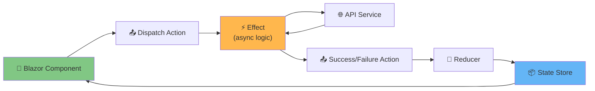

# FocusFlow - Task Management System

A production-ready task management application built with .NET 8, demonstrating **Onion Architecture**, **CQRS**, **Fluxor state management**, comprehensive testing, and containerized deployment.

---

## 📋 Table of Contents

- [Prerequisites](#-prerequisites)
- [Quick Start](#-quick-start)
  - [Option 1: Docker Compose (Recommended)](#option-1-docker-compose-recommended)
  - [Option 2: Local Development (dotnet run)](#option-2-local-development-dotnet-run)
- [Architecture](#-architecture)
- [Testing](#-testing)
- [Technology Stack](#-technology-stack)
- [Key Design Decisions (ADR)](#-key-design-decisions-adr)
- [Project Structure](#-project-structure)

--- 

## 🎯 Prerequisites

| Tool | Version | Purpose |
|------|---------|---------|
| [.NET SDK](https://dotnet.microsoft.com/download/dotnet/8.0) | 8.0+ | Build & run application |
| [Docker Desktop](https://www.docker.com/products/docker-desktop) | Latest | Containerized deployment |
| [PostgreSQL](https://www.postgresql.org/download/) | 17+ | Database (if running locally) |
| [Git](https://git-scm.com/) | Latest | Version control |
| **Optional** | | |
| [Visual Studio 2022](https://visualstudio.microsoft.com/) | 17.8+ | IDE (recommended for Windows) |
| [Rider](https://www.jetbrains.com/rider/) | 2024.1+ | IDE (cross-platform) |
| [VS Code](https://code.visualstudio.com/) | Latest | Lightweight editor |

---

## 🚀 Quick Start

### Option 1: Docker Compose (Recommended)

**This is the fastest way to run the entire stack** (API + Blazor UI + PostgreSQL):

```bash
# 1. Clone the repository
git clone https://github.com/anastasiosm/FocusFlow.git
cd FocusFlow

# 2. Create environment file (optional - defaults work fine)
cp .env.example .env

# 3. Build and start all services
docker-compose up --build

# 4. Access the application
# - Blazor UI:  http://localhost:5050
# - API:        http://localhost:8080
# - Swagger:    http://localhost:8080/swagger
# - Scalar API: http://localhost:8080/scalar/v1
# - OpenAPI JSON document: http://localhost:8080/openapi/v1.json
(The API exposes an OpenAPI JSON document useful for tooling and client generation)

# 5. Stop services
docker-compose down
```

**Default test credentials:**
- Email: `test@example.com`
- Password: `Password123!`

**Notes:**
- First build takes ~2-5 minutes (subsequent builds are faster)
- PostgreSQL data persists in a Docker volume
- Development mode runs **HTTP-only** (no HTTPS certificates needed)
- To reset the database: `docker-compose down -v`

**Optional: HTTPS Setup for Production-Like Testing**

If you need HTTPS in Docker (not required for development):

```powershell
# Windows PowerShell
pwsh scripts/setup-dev-certs.ps1

# This script:
# - Generates a development certificate using dotnet dev-certs
# - Exports PFX to both ./certs/ (for Docker) and %USERPROFILE%/.aspnet/https (for local dotnet)
# - Trusts the certificate on Windows (interactive prompt)
# - Password defaults to CERT_PASSWORD env var or "MyPfxPassword123!"

# Then enable HTTPS in docker-compose.yml by uncommenting the HTTPS configuration
```

---

### Option 2: Local Development (dotnet run)

**For active development with hot reload and debugging:**

```bash
# 1. Clone and restore dependencies
git clone https://github.com/anastasiosm/FocusFlow.git
cd FocusFlow
dotnet restore

# 2. Start PostgreSQL (via Docker or local install)
docker run -d \
  -e POSTGRES_DB=FocusFlowDb \
  -e POSTGRES_USER=postgres \
  -e POSTGRES_PASSWORD=postgres \
  -p 5432:5432 \
  postgres:17.2

# 3. Apply database migrations
cd src/FocusFlow.Infrastructure
dotnet ef database update --startup-project ../FocusFlow.WebApi
cd ../..

# 4. Run the API (terminal 1)
cd src/FocusFlow.WebApi
dotnet run
# API available at: http://localhost:5000

# 5. Run the Blazor UI (terminal 2)
cd src/FocusFlow.BlazorApp
# Edit appsettings.Development.json to set ApiBaseUrl to http://localhost:5000
dotnet run
# UI available at: http://localhost:5001

# 6. Run tests
dotnet test
```

**Configuration:**
- Update `appsettings.Development.json` in both projects for connection strings
- User secrets: `dotnet user-secrets set "Jwt:Key" "YourSecretKey"`

---

## 🏗️ Architecture

FocusFlow follows **Onion Architecture** (aka Clean Architecture) with **Vertical Slice** organization within features.

### High-Level Architecture



### Layer Responsibilities

| Layer | Responsibility | Dependencies |
|-------|---------------|--------------|
| **Domain** | Business entities, rules, exceptions | None (pure .NET) |
| **Application** | Use cases (CQRS), validation, DTOs | → Domain |
| **Infrastructure** | Data access, Identity, EF Core | → Application, Domain |
| **Presentation** | Blazor UI, Web API controllers | → Application, Infrastructure |

### Blazor UI Architecture (Fluxor Pattern)



**Flow Example (Create Project):**
1. User clicks "Create Project" → Component dispatches `CreateProjectAction`
2. `CreateProjectEffect` intercepts → Calls `IApiService.CreateProject()`
3. API responds → Effect dispatches `CreateProjectSuccessAction` or `CreateProjectFailureAction`
4. `ProjectReducer` updates `ProjectState`
5. Component re-renders with new state

---

## 🧪 Testing

FocusFlow has **5 test layers** with ~300 tests covering unit, integration, component, and end-to-end scenarios.

### Test Execution

```bash
# Run ALL tests (except E2E tests, because requires Docker for E2E tests)
dotnet test FocusFlow.sln --filter "Category!=E2E"

# Run E2E tests with full Docker orchestration
cd tests/FocusFlow.E2E.Tests
pwsh ./run-e2e-tests.ps1

# E2E test script options:
# pwsh ./run-e2e-tests.ps1 -SkipBuild           # Skip Docker image rebuild
# pwsh ./run-e2e-tests.ps1 -KeepRunning         # Keep containers running after tests
# pwsh ./run-e2e-tests.ps1 -Filter "TestName"   # Run specific test by name

# The script automatically:
# - Stops existing containers
# - Builds Docker images (unless -SkipBuild)
# - Starts all services (API, Blazor, PostgreSQL)
# - Waits for health checks (up to 180s)
# - Runs Playwright tests
# - Cleans up containers (unless -KeepRunning)

# Run specific test projects
dotnet test tests/FocusFlow.Domain.Tests              # Unit tests (Domain entities)
dotnet test tests/FocusFlow.Application.Tests         # Unit tests (CQRS handlers)
dotnet test tests/FocusFlow.Infrastructure.Tests      # Integration tests (Repositories)
dotnet test tests/FocusFlow.Integration.Tests         # API integration tests
dotnet test tests/FocusFlow.BlazorApp.Tests           # Blazor component tests (bUnit)
dotnet test tests/FocusFlow.E2E.Tests                 # E2E tests (Playwright)
```

### Test Coverage Summary

| Test Project | Type | Tests | Coverage | Purpose |
|-------------|------|-------|----------|---------|
| **Domain.Tests** | Unit | 50+ | ~95% | Entity business rules & validation |
| **Application.Tests** | Unit | 100+ | ~90% | CQRS handlers, validators, mappings |
| **Infrastructure.Tests** | Integration | 50+ | ~85% | Repository patterns, EF Core queries |
| **Integration.Tests** | Integration | 80+ | N/A | Full API endpoint testing (in-memory DB) |
| **BlazorApp.Tests** | Component | 60+ | N/A | Blazor components (bUnit), Fluxor effects |
| **E2E.Tests** | End-to-End | 15+ | N/A | Full user flows (Playwright + Docker) |

**Key Testing Frameworks:**
- **xUnit** - Test runner
- **FluentAssertions** - Readable assertions
- **Moq** - Mocking dependencies
- **Bogus** - Fake data generation
- **bUnit** - Blazor component testing
- **Playwright** - Browser automation (E2E)
- **WebApplicationFactory** - Integration testing (API)

### E2E Test Requirements

E2E tests use **Playwright + Docker Compose** and require:
1. **Docker Desktop** running
2. **Playwright browsers** installed: `pwsh tests/FocusFlow.E2E.Tests/playwright.ps1 install`
3. **PowerShell** 7+ (for `run-e2e-tests.ps1` script)

**E2E Test Scenarios:**
- ✅ User registration & login flow
- ✅ Create/edit/delete projects
- ✅ Create/assign/complete tasks
- ✅ Dashboard statistics validation
- ✅ Authorization (non-owner cannot delete projects)

**Troubleshooting E2E Tests:**

If tests timeout or fail to start:
- Check Docker Desktop is running and has sufficient resources (4GB+ RAM)
- Verify no port conflicts (5000, 8080, 5432)
- View logs: `docker-compose logs --tail=100`
- Run with `-KeepRunning` to manually inspect containers

---

## 🛠️ Technology Stack

### Core Framework
- **.NET 8** - Latest LTS framework with improved performance

### Backend Libraries

| Package | Version | Purpose |
|---------|---------|---------|
| **MediatR** | 12.4.1 | CQRS implementation (Command/Query separation) |
| **FluentValidation** | 11.0.0 | Declarative, testable validation rules |
| **AutoMapper** | 13.0.1 | Entity-to-DTO mapping (eliminates boilerplate) |
| **Entity Framework Core** | 8.0.0 | ORM with Code-First migrations |
| **Npgsql.EntityFrameworkCore.PostgreSQL** | 8.0.0 | PostgreSQL provider for EF Core |
| **EFCore.NamingConventions** | 8.0.0 | Snake_case naming for PostgreSQL (best practice) |
| **ASP.NET Core Identity** | 8.0.0 | User authentication & role management |
| **Microsoft.AspNetCore.Authentication.JwtBearer** | 8.0.0 | JWT token authentication for API |
| **Swashbuckle.AspNetCore** | 6.6.2 | OpenAPI/Swagger documentation generation |
| **Scalar.AspNetCore** | 2.11.6 | Modern interactive API documentation UI |
| **Serilog.AspNetCore** | (see project) | Structured logging integration for ASP.NET Core and centralized logging pipelines |
| **Serilog.Enrichers.Environment** | (see project) | Adds environment metadata to Serilog events (machine, environment) |
| **Serilog.Enrichers.Thread** | (see project) | Adds thread id/name information to Serilog events |

### Frontend Libraries

| Package | Version | Purpose |
|---------|---------|---------|
| **MudBlazor** | 7.8.0 | Material Design component library (rich UI components) |
| **Fluxor** | 6.9.0 | Redux-like state management for Blazor (predictable state) |
| **Fluxor.Blazor.Web** | (see project) | Blazor-specific Fluxor bindings and middleware |
| **Blazored.LocalStorage** | 4.5.0 | Browser LocalStorage wrapper (JWT persistence) |
| **Blazored.FluentValidation** | 2.2.0 | Client-side FluentValidation integration |
| **System.IdentityModel.Tokens.Jwt** | 8.15.0 | JWT token parsing (client-side role extraction) |
| **Serilog.Sinks.BrowserConsole** | (see project) | Sends Serilog events to the browser console (useful for client-side debugging in development) |
| **Microsoft.AspNetCore.Components.Authorization** | (see project) | Blazor authentication abstractions and AuthenticationStateProvider integration |
| **Microsoft.Extensions.Http** | (see project) | HttpClientFactory helpers and typed/named client support |

### Testing & Static Analysis / CI Tools

| Tool / Package | Purpose |
|----------------|---------|
| **xUnit** | Test framework (industry standard for .NET) |
| **FluentAssertions** | Readable, expressive assertions |
| **Moq** | Mocking framework for dependencies |
| **Bogus** | Realistic fake data generation (addresses, names, dates) |
| **bUnit** | Blazor component testing framework |
| **Microsoft.Playwright** | Browser automation for E2E tests (Chromium/Firefox/WebKit) |
| **Microsoft.AspNetCore.Mvc.Testing** | In-memory API integration testing |
| **SonarAnalyzer.CSharp** | Static code analysis rules (runs in IDE / during build) |
| **SonarScanner.MSBuild** | Scanner used in CI to publish results to SonarQube / SonarCloud and enforce quality gates |

### Why These Libraries?

**MediatR** - Decouples request handling from controllers; single responsibility per handler; makes testing trivial  
**FluentValidation** - More expressive than Data Annotations; supports complex rules (e.g., "EndDate must be after StartDate"); testable in isolation  
**AutoMapper** - Eliminates 100+ lines of manual mapping code; convention-based; profile-based configuration  
**Fluxor** - Redux DevTools support; time-travel debugging; single source of truth for UI state  
**MudBlazor** - 60+ pre-built components; accessibility support; responsive grid system  
**bUnit** - Renders Blazor components in-memory; queries like jQuery; tests without browser overhead  
**Playwright** - Cross-browser; auto-wait for elements; video/screenshot capture on failure  
**Scalar.AspNetCore** - Modern Swagger alternative; better UX than SwaggerUI; supports OpenAPI 3.1

---

## 📂 Project Structure

```
FocusFlow/
├── src/
│   ├── FocusFlow.Domain/                    # ✅ Core business entities
│   │   ├── Entities/
│   │   │   ├── Project.cs                   # Project aggregate root
│   │   │   ├── ProjectTask.cs               # Task entity with ownership
│   │   │   └── ApplicationUser.cs           # Identity user extension
│   │   ├── Enums/
│   │   │   ├── TaskStatus.cs                # Todo/InProgress/Done/Cancelled
│   │   │   └── Priority.cs                  # Low/Medium/High/Critical
│   │   └── Exceptions/
│   │       ├── FocusFlowException.cs        # Base exception
│   │       ├── FocusFlowValidationException.cs
│   │       ├── FocusFlowBusinessRuleException.cs
│   │       ├── FocusFlowNotFoundException.cs
│   │       └── FocusFlowUnauthorizedException.cs
│   │
│   ├── FocusFlow.Application/               # ✅ CQRS use cases
│   │   ├── Projects/
│   │   │   ├── Commands/
│   │   │   │   ├── CreateProjectCommand.cs
│   │   │   │   ├── UpdateProjectCommand.cs
│   │   │   │   └── DeleteProjectCommand.cs
│   │   │   ├── Queries/
│   │   │   │   ├── GetAllProjectsQuery.cs
│   │   │   │   └── GetProjectByIdQuery.cs
│   │   │   ├── Validators/
│   │   │   │   ├── CreateProjectCommandValidator.cs
│   │   │   │   └── UpdateProjectCommandValidator.cs
│   │   │   └── Dtos/
│   │   │       └── ProjectDto.cs
│   │   ├── Tasks/
│   │   │   ├── Commands/ (Create, Update, Assign, Complete)
│   │   │   ├── Queries/ (GetByProject, GetById, GetOverdue)
│   │   │   ├── Validators/
│   │   │   └── Dtos/
│   │   ├── Dashboard/
│   │   │   ├── Queries/
│   │   │   │   └── GetDashboardStatsQuery.cs
│   │   │   └── Dtos/
│   │   │       └── DashboardStatsDto.cs
│   │   ├── Common/
│   │   │   ├── Behaviours/
│   │   │   │   └── ValidationBehaviour.cs   # MediatR pipeline for validation
│   │   │   ├── Interfaces/
│   │   │   │   ├── IProjectRepository.cs
│   │   │   │   ├── ITaskRepository.cs
│   │   │   │   └── IUnitOfWork.cs
│   │   │   └── Mappings/
│   │   │       └── MappingProfile.cs        # AutoMapper profiles
│   │
│   ├── FocusFlow.Infrastructure/            # ✅ Data access & Identity
│   │   ├── Data/
│   │   │   ├── ApplicationDbContext.cs
│   │   │   └── Configurations/              # EF Core entity configurations
│   │   ├── Repositories/
│   │   │   ├── ProjectRepository.cs
│   │   │   ├── TaskRepository.cs
│   │   │   └── UnitOfWork.cs
│   │   ├── Identity/
│   │   │   └── ApplicationUser.cs
│   │   └── Migrations/                      # EF Core migrations
│   │
│   ├── FocusFlow.WebApi/                    # ✅ REST API
│   │   ├── Controllers/
│   │   │   ├── AuthController.cs            # Register, Login, Refresh
│   │   │   ├── ProjectsController.cs
│   │   │   ├── TasksController.cs
│   │   │   └── DashboardController.cs
│   │   ├── Middleware/
│   │   │   └── GlobalExceptionHandler.cs    # Maps exceptions to HTTP status codes
│   │   ├── Authorization/
│   │   │   ├── ProjectOwnershipHandler.cs   # Policy-based authorization
│   │   │   └── TaskOwnershipHandler.cs
│   │   └── Program.cs                       # Service registration & middleware pipeline
│   │
│   └── FocusFlow.BlazorApp/                 # ✅ Blazor Server UI
│       ├── Components/
│       │   ├── Layout/
│       │   │   ├── MainLayout.razor
│       │   │   ├── NavMenu.razor
│       │   │   └── LoginDisplay.razor
│       │   ├── Pages/
│       │   │   ├── Index.razor              # Dashboard
│       │   │   ├── Login.razor
│       │   │   ├── Register.razor
│       │   │   ├── Projects.razor           # Project list
│       │   │   └── ProjectDetails.razor     # Project + tasks view
│       │   ├── Projects/
│       │   │   ├── ProjectCard.razor
│       │   │   ├── ProjectEditForm.razor
│       │   │   └── DeleteProjectDialog.razor
│       │   └── Tasks/
│       │       ├── TaskCard.razor
│       │       ├── CreateTaskDialog.razor
│       │       └── TaskListView.razor
│       ├── Store/                           # Fluxor state management
│       │   ├── Auth/
│       │   │   ├── AuthState.cs
│       │   │   ├── LoginAction.cs
│       │   │   ├── LoginEffect.cs
│       │   │   └── AuthReducers.cs
│       │   ├── Projects/
│       │   │   ├── ProjectState.cs
│       │   │   ├── LoadProjectsAction.cs
│       │   │   ├── LoadProjectsEffect.cs
│       │   │   └── ProjectReducers.cs
│       │   └── ProjectDetail/               # Project + tasks combined state
│       │       ├── ProjectDetailState.cs
│       │       ├── CreateTaskAction.cs
│       │       ├── CreateTaskEffect.cs
│       │       └── ProjectDetailReducers.cs
│       ├── Services/
│       │   ├── IApiService.cs
│       │   ├── ApiService.cs                # HTTP client wrapper
│       │   └── AuthenticationStateProvider.cs
│       └── Program.cs
│
├── tests/
│   ├── FocusFlow.Domain.Tests/              # ✅ 50+ tests
│   ├── FocusFlow.Application.Tests/         # ✅ 100+ tests
│   ├── FocusFlow.Infrastructure.Tests/      # ✅ 50+ tests
│   ├── FocusFlow.Integration.Tests/         # ✅ 80+ tests (API)
│   ├── FocusFlow.BlazorApp.Tests/           # ✅ 60+ tests (bUnit)
│   └── FocusFlow.E2E.Tests/                 # ✅ 15+ tests (Playwright)
│       ├── AuthenticationFlowTests.cs
│       ├── ProjectManagementFlowTests.cs
│       ├── TaskManagementFlowTests.cs
│       ├── DashboardTests.cs
│       ├── PlaywrightFixture.cs
│       └── run-e2e-tests.ps1               # E2E test orchestration script
│
├── scripts/
│   └── setup-dev-certs.ps1                  # HTTPS certificate generation (optional)
│
├── docker-compose.yml                       # Production-like Docker setup
├── docker-compose.override.yml              # Development overrides (HTTP-only)
├── .env.example                             # Environment variable template
├── .gitignore
└── README.md
```

---

## 🎯 Key Design Decisions (ADR)

### ADR-001: Onion Architecture Over N-Tier
**Decision:** Use Onion Architecture (Clean Architecture variant)  
**Rationale:** 
- Domain layer has **zero dependencies** (pure business logic)
- Easier to test (mock infrastructure)
- Framework-agnostic domain layer
- Enforces dependency inversion (infrastructure depends on domain, not vice versa)

**Consequences:**  
✅ Better testability (~95% domain coverage)  
✅ Business logic isolated from infrastructure changes  
⚠️ More projects (4 layers) but clearer separation

---

### ADR-002: CQRS with MediatR
**Decision:** Separate Commands (writes) from Queries (reads) using MediatR  
**Rationale:**
- **Single Responsibility** - Each handler does one thing
- **Testability** - Mock `IMediator` instead of 10+ service methods
- **Performance** - Queries can bypass domain validation
- **Clarity** - `CreateProjectCommand` vs `GetAllProjectsQuery` is self-documenting

**Consequences:**  
✅ 100+ handlers, each <50 lines  
✅ Easy to add new features (just add handler)  
⚠️ More files, but organized by feature (Vertical Slice)

**Example:**
```csharp
// Command (write)
public record CreateProjectCommand(string Name, DateTime StartDate) : IRequest<Result<ProjectDto>>;

// Query (read)
public record GetAllProjectsQuery(string UserId) : IRequest<Result<List<ProjectDto>>>;
```

---

### ADR-003: Vertical Slice Architecture in Application Layer
**Decision:** Organize by feature (Tasks/, Projects/) instead of technical layer (Commands/, Queries/)  
**Rationale:**
- **Cohesion** - All "Create Task" artifacts in one folder
- **Discoverability** - Easy to find related code
- **Team scalability** - Features can be developed independently

**Structure:**
```
Tasks/
  Commands/
    CreateTaskCommand.cs
    CreateTaskCommandHandler.cs
    CreateTaskCommandValidator.cs
  Queries/
    GetTaskByIdQuery.cs
    GetTaskByIdQueryHandler.cs
  Dtos/
    TaskDto.cs
```

---

### ADR-004: FocusFlow-Branded Exceptions
**Decision:** Prefix all domain exceptions with `FocusFlow` (e.g., `FocusFlowNotFoundException`)  
**Rationale:**
- **Explicit** - No confusion with framework exceptions
- **Searchable** - Easy to find in logs
- **Branding** - Clear ownership of exception types

**Consequences:**  
✅ No namespace conflicts  
✅ Global exception handler easily maps to HTTP status codes  
⚠️ Longer names

**Exception Hierarchy:**
```
FocusFlowException (base)
├── FocusFlowValidationException → 400 Bad Request
├── FocusFlowBusinessRuleException → 422 Unprocessable Entity
├── FocusFlowNotFoundException → 404 Not Found
└── FocusFlowUnauthorizedException → 403 Forbidden
```

---

### ADR-005: FluentValidation Over Data Annotations
**Decision:** Use FluentValidation for all validation logic  
**Rationale:**
- **Testable** - Validators are POCO classes
- **Expressive** - `RuleFor(x => x.EndDate).GreaterThan(x => x.StartDate)`
- **Reusable** - Compose validators
- **Complex rules** - Cross-property, async DB checks

**Consequences:**  
✅ Validation lives in Application layer (not Domain)  
✅ MediatR pipeline runs all validators automatically  
⚠️ Extra package dependency

**Example:**
```csharp
public class CreateProjectCommandValidator : AbstractValidator<CreateProjectCommand>
{
    public CreateProjectCommandValidator()
    {
        RuleFor(x => x.Name)
            .NotEmpty().WithMessage("Project name is required")
            .MaximumLength(200);
        
        RuleFor(x => x.EndDate)
            .GreaterThan(x => x.StartDate)
            .When(x => x.EndDate.HasValue);
    }
}
```

---

### ADR-006: AutoMapper for DTOs
**Decision:** Use AutoMapper for Entity↔DTO mapping  
**Rationale:**
- **DRY** - Define mapping once, use everywhere
- **Convention-based** - Automatically maps properties with same name
- **Testable** - `AssertConfigurationIsValid()`

**Consequences:**  
✅ Eliminates 500+ lines of manual mapping code  
✅ Profiles document transformations  
⚠️ "Magic" behavior (convention-based)

---

### ADR-007: Fluxor for Blazor State Management
**Decision:** Use Fluxor (Redux pattern) instead of Blazor's built-in state containers  
**Rationale:**
- **Predictable** - Single source of truth
- **DevTools** - Redux DevTools support (time-travel debugging)
- **Testable** - Reducers are pure functions
- **Scalable** - Clear action → effect → reducer flow

**Consequences:**  
✅ Easier to debug state changes  
✅ Supports complex async workflows (e.g., optimistic updates)  
⚠️ Learning curve for developers unfamiliar with Redux

**Flow:**
```
Component → Dispatch(CreateProjectAction) 
  → CreateProjectEffect (async API call) 
    → Dispatch(CreateProjectSuccessAction) 
      → ProjectReducer (updates state) 
        → Component re-renders
```

---

### ADR-008: MudBlazor for UI Components
**Decision:** Use MudBlazor over Bootstrap or custom components  
**Rationale:**
- **Rich components** - DataGrid, DatePicker, Autocomplete, Dialogs
- **Material Design** - Modern, consistent UI
- **Accessibility** - ARIA attributes built-in
- **Active maintenance** - 7k+ GitHub stars

**Consequences:**  
✅ Faster UI development  
✅ Responsive grid system  
⚠️ ~2MB bundle size (but tree-shakeable)

---

### ADR-009: Playwright for E2E Tests
**Decision:** Use Playwright over Selenium  
**Rationale:**
- **Auto-wait** - No `Thread.Sleep()` or manual waits
- **Cross-browser** - Chromium, Firefox, WebKit
- **Video/screenshot** - Automatic on test failure
- **Modern API** - Async/await, auto-retry

**Consequences:**  
✅ Reliable E2E tests (no flakiness)  
✅ Debugging with video recordings  
⚠️ Requires browser installation (~300MB)

---

### ADR-010: PostgreSQL Over SQL Server
**Decision:** Use PostgreSQL as the primary database  
**Rationale:**
- **Open-source** - No licensing costs
- **Docker-friendly** - Official image, easy setup
- **JSON support** - Native JSONB type (future analytics)
- **Performance** - Better concurrency with MVCC

**Consequences:**  
✅ Easy local development (Docker)  
✅ Cloud-agnostic (AWS RDS, Azure PostgreSQL, etc.)  
⚠️ Different from SQL Server (no `IDENTITY`, uses `SERIAL`)

---

### ADR-011: JWT Authentication for API
**Decision:** Use JWT tokens for API authentication (not session cookies)  
**Rationale:**
- **Stateless** - No server-side session storage
- **Scalable** - Works across multiple API instances
- **Mobile-friendly** - Easy to use in non-browser clients
- **Claims-based** - Roles embedded in token

**Consequences:**  
✅ Blazor app stores JWT in LocalStorage  
✅ API validates token signature (no DB lookup per request)  
⚠️ Token refresh logic needed (implement refresh tokens)

---

### ADR-012: Docker Compose for Local Development
**Decision:** Provide `docker-compose.yml` as the primary local dev environment  
**Rationale:**
- **Consistency** - Same environment for all developers
- **Database included** - No manual PostgreSQL setup
- **CI/CD parity** - Mirrors production deployment
- **Fast onboarding** - `docker-compose up` = working app

**Consequences:**  
✅ New developers productive in <5 minutes  
✅ Tests run against real database (not in-memory SQLite)  
⚠️ Requires Docker Desktop (~4GB RAM)

---

### ADR-013: HTTP-Only Development Mode
**Decision:** Run Docker containers with HTTP (not HTTPS) in development  
**Rationale:**
- **Simplicity** - No certificate setup for first-time users
- **Faster** - No HTTPS overhead
- **Localhost** - Browsers allow HTTP on localhost

**Consequences:**  
✅ `docker-compose up` works immediately  
✅ No certificate errors  
⚠️ Production must enable HTTPS (see `scripts/setup-dev-certs.ps1` for cert generation)

---

### ADR-014: Repository Pattern with Unit of Work
**Decision:** Use Repository + UnitOfWork pattern despite EF Core's DbContext already being a UoW  
**Rationale:**
- **Testability** - Mock `IProjectRepository` instead of DbContext
- **Abstraction** - Business logic doesn't know about EF Core
- **Complex queries** - Encapsulate in repository methods

**Consequences:**  
✅ Easy to test Application layer (mock repositories)  
✅ Could swap EF Core for Dapper/ADO.NET without changing handlers  
⚠️ Extra abstraction layer (some argue it's redundant)

---

### ADR-015: bUnit for Blazor Component Testing
**Decision:** Use bUnit for testing Blazor components  
**Rationale:**
- **In-memory** - No browser needed
- **Fast** - ~100ms per test
- **Queries** - Find elements like `Find("button.save")`
- **Event simulation** - Click, input, etc.

**Consequences:**  
✅ Tests Blazor components in isolation  
✅ Catches UI bugs before E2E tests  
⚠️ Cannot test CSS/layout (need E2E for that)